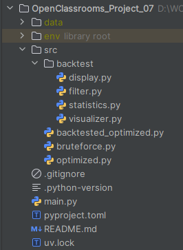
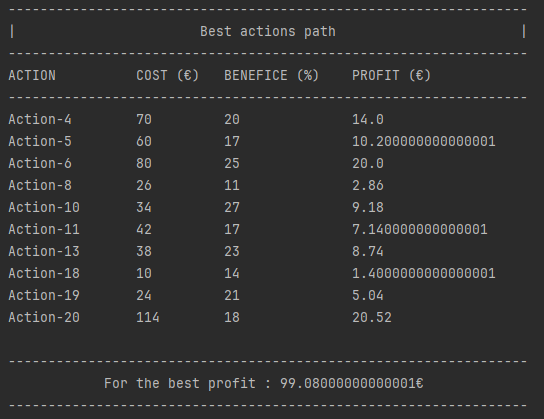

# ALGORITHMS - OpenClassrooms Project 07
**Solve problems using algorithms in Python**

---

## DESCRIPTION

This project was completed as part of the "Python Developer" path at OpenClassrooms.

The goal was to develop an application based on algorithms capable of:
- Maximizing clients profits after a 2-year investment.

The application must include:
- A brute-force algorithm, initially
- An optimized version, then
- And finally, a version optimized and retrospectively tested on historical company files. 
---

## EXPLANATIONS OF WHAT THE APP DOES

### <u>Bruteforce version</u>

- Calculate the best actions path using brute-force algorithm. 
All combinations are calculated by building a recursive tree.

### <u>Optimized version</u>

- Calculate the best actions path using the dynamic programming algorithm 
which is better optimized than the previous one.

### <u>Final backtested and optimized version</u>

- Calculate the best action path using the optimized algorithm and perform backtests on this solution, then compare the
results to a third-party solution applied to the same datasets.

---

## PROJECT STRUCTURE

---

## INSTALLATION

### - Clone the repository :
`git clone https://github.com/Tit-Co/OpenClassrooms_Project_04.git`

### - Navigate into the project directory :
`cd OpenClassrooms_Project_04`

### - Create a virtual environment and dependencies :
### Option 1 - with [uv](https://docs.astral.sh/uv/)

`uv` is an environment and dependencies manager.

#### - Install environment and dependencies

`uv sync`

### Option 2 - with pip

#### - Install the virtual env :

`python -m venv env`

#### - Activate the virtual env :
`source env/bin/activate`  
Or  
`env\Scripts\activate` on Windows  

### - Install dependencies 
#### Option 1 - with [uv](https://docs.astral.sh/uv/)

`uv pip install -U -r requirements.txt`

#### Option 2 - with pip

`pip install -r requirements.txt` 

---

## USAGE

### Launch each Python file in the console
Examples: 
- For the brute-force version : `python bruteforce.py`
- For the optimized version : `python optimized.py`
- For the optimized version and with solutions backtest : `python optimized_with_backtest.py`

---

## EXAMPLES

- Brute-force

    

- Optimized : Dynamic Programming

    

---

## MAIN FEATURES

- Brute-force
- Optimized
- Backtested and optimized

---

---

## AUTHOR
**Name**: Nicolas MARIE  
**Track**: Python Developer – OpenClassrooms  
**Project – Solve problems using algorithms in Python – December 2025**
